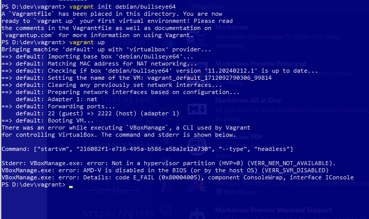

# H1 - Server-Management-24

This is documentation of assignment & testing using Salt and Vagrant Locally in assignment H1
## Table of Contents

<!-- @import "[TOC]" {cmd="toc" depthFrom=1 depthTo=6 orderedList=false} -->

<!-- code_chunk_output -->

- [H1 - Server-Management-24](#h1---server-management-24)
  - [Table of Contents](#table-of-contents)
  - [:memo: About / Platform](#memo-about--platform)
  - [:computer: Salt on Windows 10](#computer-salt-on-windows-10)
  - [:computer: Vagrant on Windows 10](#computer-vagrant-on-windows-10)
  - [:hammer: Creating a VM with Vagrant](#hammer-creating-a-vm-with-vagrant)
  - [:zap: Vagrant SSH](#zap-vagrant-ssh)
  - [Salt-Minion for Debian](#salt-minion-for-debian)
  - [:mag: Salt common commands examples](#mag-salt-common-commands-examples)
    - [pkg.installed & pkg.removed](#pkginstalled--pkgremoved)
    - [file.managed & file.absent](#filemanaged--fileabsent)
    - [service.running & service.dead](#servicerunning--servicedead)
    - [user.present & user.absent](#userpresent--userabsent)
    - [cmd.run](#cmdrun)
    - [status.uptime](#statusuptime)
  - [Gathering host data with grains.items](#gathering-host-data-with-grainsitems)
  - [:wrench: Tools used](#wrench-tools-used)
  - [:clipboard: References](#clipboard-references)

<!-- /code_chunk_output -->


[toc]

## :memo: About / Platform

Assignment took me 4 hours to complete including problem solving and documenting.

**PC Specs:**

Windows 10
AMD R9 5900X
32GB DDR4
Asus x570-p

Salt, Vagrant & VirtualBox pre-installed

## :computer: Salt on Windows 10

We installed Salt previously during online class but now we can check that it is installed.

Lets start by running PowerShell with administrator privileges by pressing ``` Windowskey+X ``` and choosing *Windows PowerShell(admin)*


Then we run the command

```salt-call --version```


As a result we are given the salt version indicating it is installed.

## :computer: Vagrant on Windows 10

As we already have Vagrant installed we can also confirm it by running a vagrant command, I could not remember any specific command to test so I just ran ```vagrant --help``` which printed me with the vagrant help text including common commands:


*vagrant --help* command is working, so we move forward.

## :hammer: Creating a VM with Vagrant

For creating a virtual machine we use the command vagrant init, and for image we are choosing debian/bullseye64, we run the following command:

```vagrant init debian/bullseye64```


Next steps is to run

``` vagrant up ```



:warning: We ran into our first problem, it seems we have Virtualization disabled in bios, lets fix this!

We boot into BIOS and enter the advanced cpu settings, from here we can see that SVM Mode is *Disabled*


We change it to *Enabled* and save & reset hoping this fixes the error.

After bootup we launch PowerShell in admin mode again, lets try ```vagrant up``` command again:


It works! lets move forward to ssh part.

## :zap: Vagrant SSH

To connect to our newly created VM, we use the ```vagrant ssh``` command


We are in! :rocket:


## Salt-Minion for Debian
For Salt-Minion installation we are using the guide from [saltproject.io documentation](https://docs.saltproject.io/salt/install-guide/en/latest/topics/install-by-operating-system/debian.html#install-salt-on-debian-11-bullseye-amd64).

For *Best Practices*  we pin the Salt upgrades for integrity and authenticity purposes using following commands:

```
sudo mkdir /etc/apt/keyrings

sudo curl -fsSL -o /etc/apt/keyrings/salt-archive-keyring-2023.gpg https://repo.saltproject.io/salt/py3/debian/11/amd64/SALT-PROJECT-GPG-PUBKEY-2023.gpg
echo "deb [signed-by=/etc/apt/keyrings/salt-archive-keyring-2023.gpg arch=amd64] https://repo.saltproject.io/salt/py3/debian/11/amd64/latest bullseye main" | sudo tee /etc/apt/sources.list.d/salt.list
```

We run into our second problem *sudo: curl: command not found*

This means we have to install curl, lets try 
```
sudo apt-get install curl
```

It works!

Then we upgrade packages
```
sudo apt-get update
```


Next step is to install salt-minion, lets run

```
sudo apt-get install salt-minion
```
Installation was successful, lets confirm with the version command
```
salt-call --local --version
```
All good! Salt-Minion successfully installed on VM.

## :mag: Salt common commands examples

### pkg.installed & pkg.removed
Pkg.installed command lets us install, or check if a package is installed, lets try the following command to check package called "tree"
```
sudo salt-call --local -l info state.single pkg.installed tree
```

It is now installed, lets proceed to remove(uninstall) the package with pkg.removed
```
sudo salt-call --local -l info state.single pkg.removed tree
```
### file.managed & file.absent

file.managed command lets us create files, lets try
```
sudo salt-call --local -l info state.single file.managed /tmp/hello
```
then we can check if file was created with
```
ls  /tmp/hello
```

We can see that the file was created but we got a warning about content missing, lets create another file with some content added with the contents="" string.

```
sudo salt-call --local -l info state.single file.managed /tmp/hello2 contents="hi"
```

File is created without warnings, then we can confirm it contains the text "hi" with the following command:
```
cat /tmp/hello2
```

File.absent lets us remove the file
```
sudo salt-call --local -l info state.single file.absent /tmp/hello2
```

confirmed removal with cat.

### service.running & service.dead

service running command for restarting daemon, in the following test we enable apache2 automatic start with the command
```
sudo salt-call --local -l info state.single service.running apache2 enable=True
```


:warning: we ran into a problem, lets check if apache2 is installed.

```
sudo apt-get install apache2
```

seems to be installing now, lets try the command again after installation


After this we run service.dead to stop the daemon, containing enable=False to disable start on boot
```
sudo salt-call --local -l info state.single service.dead apache2 enable=False
```

### user.present & user.absent

user.present lets us check if a user exists, we try following

```
sudo salt-call --local -l info state.single user.present vagrant
```

Result: **True**. we seem to exist, now lets check user.absent command

```
sudo salt-call --local -l info state.single user.absent vagrant
```
this returns an expected **false** result


### cmd.run
Here we can try running a command, that creates if not already existing


```
sudo salt-call --local -l info state.single cmd.run 'touch /tmp/foo' creates="/tmp/foo"
```

we run the same command again, noticing comment saying it already exists, so we dont change it, good example of idempotent command.

### status.uptime
command to see the uptime


## Gathering host data with grains.items

grains.items pulls a wall of text containing data about the host, we can specify with grains.item and pull certain parts of it, here is a example of a customized command pulling only some networking related data:

```
sudo salt-call --local grains.item ip4_interfaces ip6_interfaces ip_interfaces dns domain
```


## :wrench: Tools used

Salt

Vagrant

VirtualBox

Visual Studio Code
 -Markdown Preview Github Styling (extension)


## :clipboard: References


Assignment
https://terokarvinen.com/2024/configuration-management-2024-spring/
(Karvinen 2024)

Salt commands locally guide
https://terokarvinen.com/2021/salt-run-command-locally/
(Karvinen 2023)

Salt.states manual
https://docs.saltproject.io/en/latest/ref/states/all/salt.states.service.html

Salt Module reference
https://docs.saltproject.io/en/latest/ref/index.html

(*install salt on debian*)
https://docs.saltproject.io/salt/install-guide/en/latest/topics/install-by-operating-system/debian.html#install-salt-on-debian-11-bullseye-amd64

Documentation guide
https://terokarvinen.com/2006/06/04/raportin-kirjoittaminen-4/
(Karvinen 2006)

Markdown emoji list
https://gist.github.com/rxaviers/7360908