# H2 - Call Home

## :clipboard: Table of Contents
- [H2 - Call Home](#h2---call-home )
  - [:clipboard: Table of Contents](#clipboard-table-of-contents )
  - [Assignment & Source Summary (X)](#assignment--source-summary-x )
  - [Installing VM:s with vagrant (A)](#installing-vms-with-vagrant-a )
  - [Master-Slave architecture setup (B)](#master-slave-architecture-setup-b )
    - [Master setup](#master-setup )
    - [Minion setup](#minion-setup )
    - [Confirm slave-key on master](#confirm-slave-key-on-master )
  - [:dart: Running commands on slave with master (C)](#dart-running-commands-on-slave-with-master-c )
  - [Running state.single idempotent commands (D)](#running-statesingle-idempotent-commands-d )
  - [:notebook: Gather technical data of slaves (E)](#notebook-gather-technical-data-of-slaves-e )
  - [:incoming_envelope: Infra as code(F)](#incoming_envelope-infra-as-codef )
  - [:wrench: Tools used](#wrench-tools-used )
  - [:clipboard: References](#clipboard-references )

## Assignment & Source Summary (X)

**A**
Install two virtual machines on the same network. Show that you can use both machines (eg 'vagrant ssh t001'). Show that machines can ping each other. (This task is easiest to do with Vagrant)

**B**
Set up Salt's master-slave architecture to work over the network. (The network can be a virtual network between local virtual machines, as in other subsections)

**C**
Run a command on the slave over Salt's master-slave connection.

**D**
Run idempotent (state.single) commands over the master-slave connection.

**E**
Collect technical information about slaves over the network (grains.item)

**F**
IaC. Make infra as code by typing /srv/salt/hello/init.sls. Drive the modules to a slave. The module can for example, create an example file in a directory. Test with another command that the change you requested has really been made.


## Installing VM:s with vagrant (A) 
<sup><sub>Time 12:05-12:15</sub></sup>


We fire up powershell in admin mode like in previous assignment. ```winkey+x``` -> powershell as admin

Created file Vagrantfile in a new folder ```New-Item Vagrantfile```

Then we edit the file and paste in the following configurations from our [guide](https://terokarvinen.com/2021/two-machine-virtual-network-with-debian-11-bullseye-and-vagrant/):

```
# -*- mode: ruby -*-
# vi: set ft=ruby :
# Copyright 2019-2021 Tero Karvinen http://TeroKarvinen.com

$tscript = <<TSCRIPT
set -o verbose
apt-get update
apt-get -y install tree
echo "Done - set up test environment - https://terokarvinen.com/search/?q=vagrant"
TSCRIPT

Vagrant.configure("2") do |config|
	config.vm.synced_folder ".", "/vagrant", disabled: true
	config.vm.synced_folder "shared/", "/home/vagrant/shared", create: true
	config.vm.provision "shell", inline: $tscript
	config.vm.box = "debian/bullseye64"

	config.vm.define "t001" do |t001|
		t001.vm.hostname = "t001"
		t001.vm.network "private_network", ip: "192.168.88.101"
	end

	config.vm.define "t002", primary: true do |t002|
		t002.vm.hostname = "t002"
		t002.vm.network "private_network", ip: "192.168.88.102"
	end
	
end
```


Now we start the machines and test connectivity ```vagrant up``` 
when vms are up we login to t001 with ```vagrant ssh t001```

testing connection between the VM's by pinging t002 from t001

```
ping -c 1 192.168.88.102
```
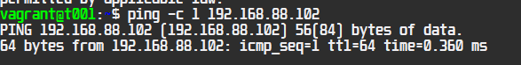

And we tested same on t002

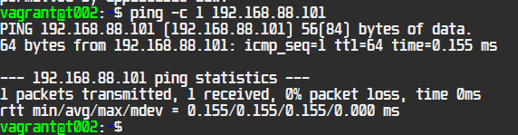

It works, then we move forward.

## Master-Slave architecture setup (B) 
<sup><sub>Time 12:15-12:30</sub></sup>

### Master setup

Ssh into t001 

```
sudo apt-get update
```
```
sudo apt-get -y install salt-master
```

then we confirm our ip again by typing ```hostname -I```

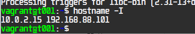

Lets exit and move to minion setup

### Minion setup

```
vagrant ssh t002
``` 
When we are on the vm, lets run the update command
```
sudo apt-get update
```
then lets install salt minion with
```
sudo apt-get -y install salt-minion
```
Then we need to add master ip into minion config:
```
sudo nano /etc/salt/minion
```

here we add the master ip, and for best-practice we add slave-id also.

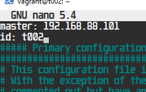

after saving settings we restart the salt minion service

``` 
sudo systemctl restart salt-minion.service
```

### Confirm slave-key on master

Last step in setting up the master-slave connection is accepting the slave key on master. For this we ssh back into the master vm.(t001)

```
sudo salt-key -A
```
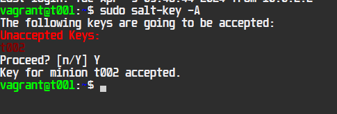

## :dart: Running commands on slave with master (C) 
<sup><sub>Time 12:35-12:40</sub></sup>

Example command "whoami". This command is run on the master (t001), asking all('*') slaves the "whoami" command, as we only have one slave, we get one response.

```
 sudo salt '*' cmd.run 'whoami'
```
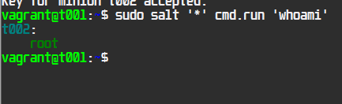

then we try other commands aswell:

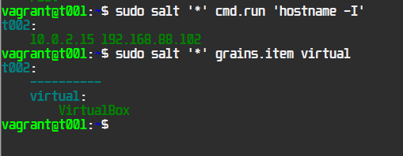

All commands work, so we move forward.

## Running state.single idempotent commands (D)

Lets do a state.single command to check running service ssh

``` 
sudo salt '*' state.single service.running name=ssh enable=True
```
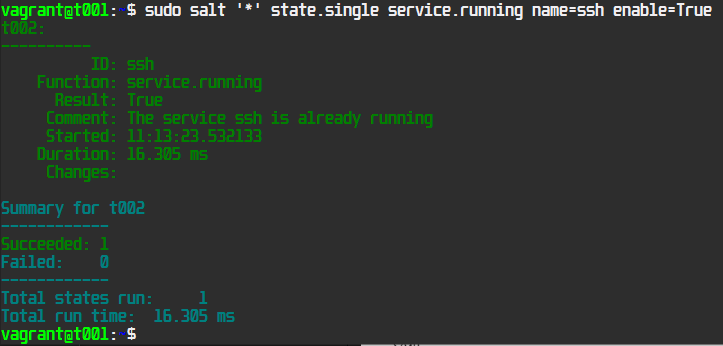

ssh is running, command succeeded. no changes.

Lets try installing a package. And then run the same command again to see that nothing changes

```
sudo salt '*' state.single pkg.installed name=nginx
```
```
sudo salt '*' state.single pkg.installed name=nginx
```
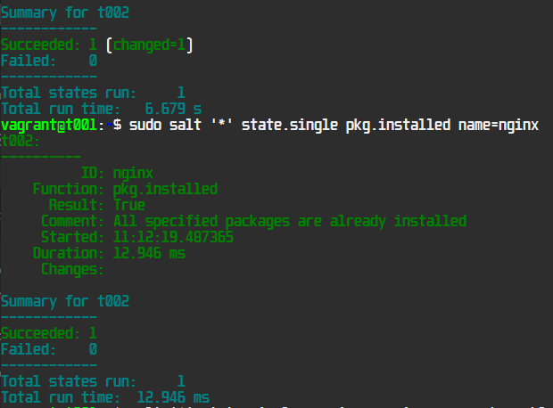

First time we ran the command, the slave reports several packages installed. Second time we run it we get confirmation it is installed, so nothing is done.

Lets try accessing the webserver on our host machine in the same network


Then lastly we created a temp folder for all slaves, and run the command again to confirm idempotency.

```
sudo salt '*' state.single file.directory name=/tmp/test
```
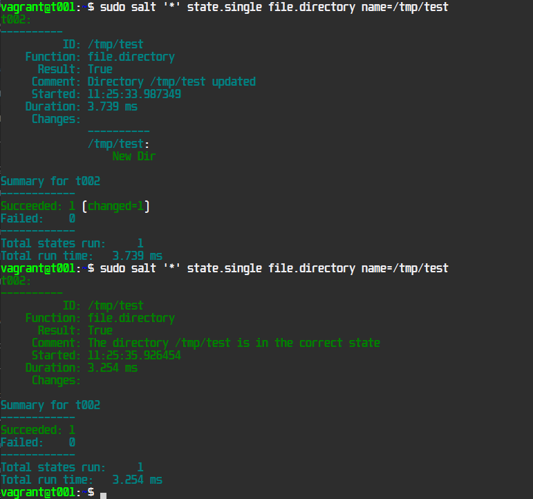

## :notebook: Gather technical data of slaves (E)
<sup><sub>Time 12:40-12:55</sub></sup>

We are planning ahead for a future project that requires MAC addresses for Wake on Lan. And also documenting slaves specs.

We start with investigating the grains.items list for the needed data

```
sudo salt '*' grains.items | less
```

we need mac address, ip address and hostname, the following command gives us this info

```
sudo salt '*' grains.item hwaddr_interfaces ip4_interfaces host
```
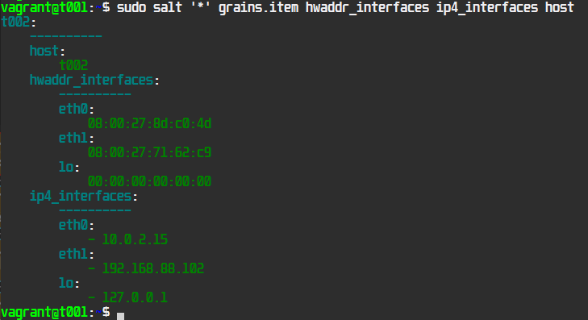

For additional pc specs we gather following fields:

```
 sudo salt '*' grains.item num_cpus cpu_model mem_total disks host osfinger username
```

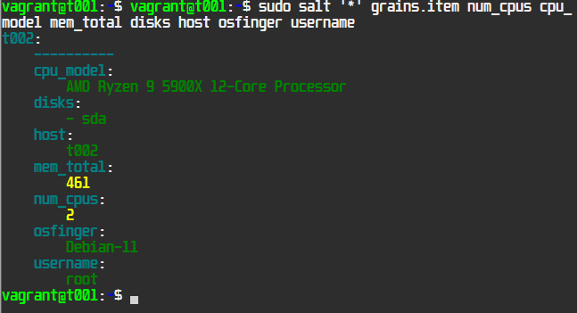

## :incoming_envelope: Infra as code(F)
<sup><sub>Time 14:30-15:30</sub></sup>

We created a module_test folder for modules
```
sudo mkdir -p /srv/salt/module_test/
```

we enter the folder and create an sls file:

```
sudo nano init.sls
```
and enter the following test sls configuration into the file and save it.

```
/tmp/testing:
  file.managed
```
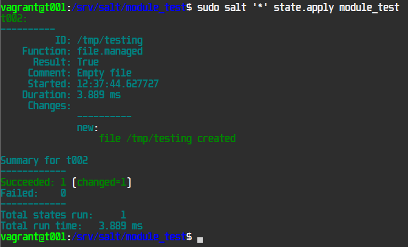

temp testing file was created, if we run the command again we can see the summary is succeeded, and nothing changed.

alternatively we can check the file also with a command instead of module

``` 
sudo salt '*' state.single file.managed /tmp/testing
```


next we created a script to check if nano, irssi and screen are installed, we created a new folder /srv/salt/check_packages, inside we ```sudo nano init.sls``` and type the following configuration:

```
check_packages_installed:
  pkg.installed:
    - pkgs:
      - nano
      - irssi
      - screen
```


then we run the command to check if slaves have the packages installed:

```
sudo salt '*' state.apply check_packages
```
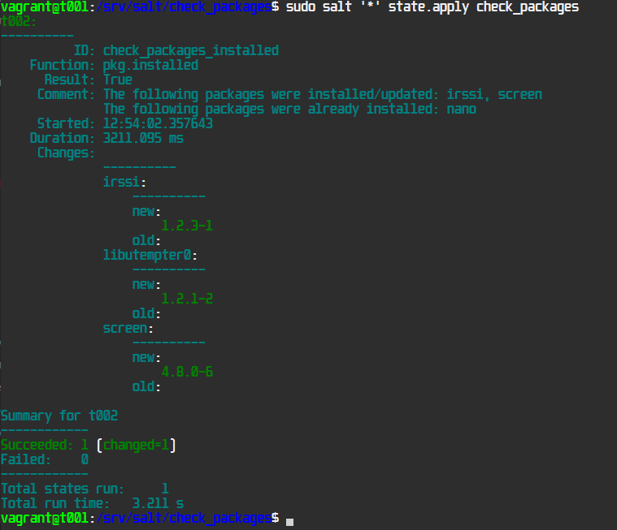

As we can see nano was previously installed, but screen and irssi were now installed by the command. also libutempter0 was installed since its required for screen.


## :wrench: Tools used

Salt

Vagrant

VirtualBox

Visual Studio Code
 -Markdown Preview Github Styling (extension)

*oh-my-posh* easyterm powershell theme

## :clipboard: References

https://www.unixmen.com/saltstack-examples/
pkgs module examples


https://docs.saltproject.io/salt/user-guide/en/latest/topics/states.html


https://terokarvinen.com/2021/two-machine-virtual-network-with-debian-11-bullseye-and-vagrant/
Karvinen 2021

https://terokarvinen.com/2024/hello-salt-infra-as-code/
Karvinen 2014

https://terokarvinen.com/2018/salt-quickstart-salt-stack-master-and-slave-on-ubuntu-linux/?fromSearch=salt%20quickstart%20salt%20stack%20master%20and%20slave%20on%20ubuntu%20linux
Karvinen 2018