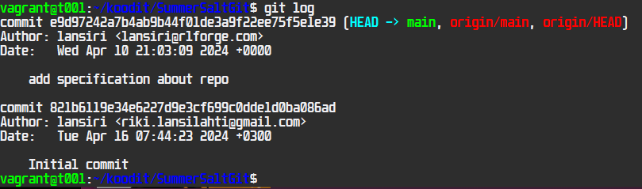
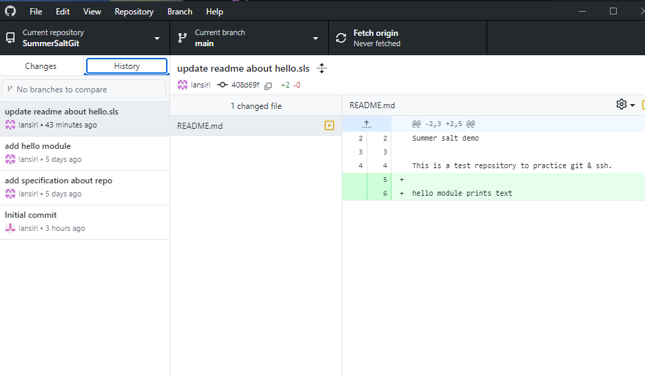

# 🌐 h3 Stable version

- [🌐 h3 Stable version](#-h3-stable-version )
  - [📝 Assignment & Summary](#-assignment--summary )
    - [📘 About Git](#-about-git )
    - [⌨️ Common commands](#️-common-commands )
    - [📚 suolax repository history](#-suolax-repository-history )
    - [📄 Assignments](#-assignments )
  - [🆕 New Repository (A)](#-new-repository-a )
  - [📡 Github Cloning repository (B)](#-github-cloning-repository-b )
    - [🔑 Generating SSH key](#-generating-ssh-key )
    - [🗂️ Cloning a repository](#️-cloning-a-repository )
    - [🚀 Pushing commits](#-pushing-commits )
  - [↩️ Git reset (C)](#️-git-reset-c )
  - [📜 Git Logs (D)](#-git-logs-d )
    - [🖨️ Printing logs in shell](#️-printing-logs-in-shell )
    - [👤 Author name and email](#-author-name-and-email )
  - [🧂 Run Salt module from repository](#-run-salt-module-from-repository )
  - [🔄 Another way to Git (F)](#-another-way-to-git-f )
    - [🖱️ Point & Click Git - Github desktop (Windows)](#️-point--click-git---github-desktop-windows )
  - [🤝 Collaborate on github (G)](#-collaborate-on-github-g )
    - [🤖 Github Bot](#-github-bot )
    - [Collaborating](#collaborating )
  - [:wrench: Tools used](#wrench-tools-used )
  - [:clipboard: References](#clipboard-references )

## 📝 Assignment & Summary

### 📘 About Git

This assignment is all about Git the most popular version control system used mostly for programming and collaboration. Most widely used Git platform is Github, home for most open-source projects.


### ⌨️ Common commands

The most common git CLI oneliner command for updating all local files to repo is:
```
git add . && git commit; git pull && git push
```

```git add .```: Adds all new and changed files in the current directory to the staging area, preparing them for a commit.

```&&``` Adds logic to only continue if the previous command succeeded.

```git commit```: Saves the staged changes to the local repository as a new "commit," which is like a snapshot of your work at that point in time.

```;``` Adds logic. this is a divider, that executes the next command "git pull" regardless if previous command works or not.

```git pull```: Updates current branch with the latest changes from the remote repository, merging them with your local changes.

```git push```: Uploads committed changes to the remote repository.

### 📚 suolax repository history

We are looking at https://github.com/terokarvinen/suolax/ commit history


When we open the latest commit "Improve usage instructions", we see the following:


The rows with green highlight and "+" sign indicates what was added and the red with "-" what was removed.

A similiar list can be printed in terminal with the command

```
git clone https://github.com/terokarvinen/suolax.git; cd suolax/; git log --patch --color|less -R
```


It prints us the commits in text, similiar to the web interface. also showing author and date.

### 📄 Assignments

a)  Make a new repository on GitHub. The name and short description of the repo must contain the word "summer".
b) Dolly. Clone the new repository made in the previous section for yourself, make changes on your own machine, push them to the server, and show that they appear in the web interface.
c) Make a stupid change to git, don't commit. Destroy bad changes with 'git reset --hard'. Note that there is no cancel button for this function.
d) Logs. View and explain your log. Check that your name and email address appear as you want and correct if necessary.
e) Run Salt farms from your own warehouse. (Salt files from any directory "--file-root teronSaltDirectory". For example 'sudo salt-call --local --file-root srv/salt/ state.apply', notice the relative path.)
f) Optional: The other system: try Git on a different operating system than the one you did the other exercises on. Explain in such a way that even someone who does not know the system can succeed. There are plenty of possibilities: Debian, Fedora, Windows, OSX...
g) Optional: cooperation: give your friend (or alter ego) the right to write to your repository (commit access). Both make changes to the repository with git.

## 🆕 New Repository (A)

We start with logging into Github with a browser, tapping (+) and  new repository.


We choose the repository name [SummerSaltGit](https://github.com/lansiri/SummerSaltGit) and initialize the repo with a readme file in the creation setup.

The repository is now created and live & public https://github.com/lansiri/SummerSaltGit 

## 📡 Github Cloning repository (B)

When cloning the repo, we will use SSH and command line commands.


For this we need to add a SSH key, lets open the github link "add a new ssh key" and hop over to our shell for ssh key generation.

### 🔑 Generating SSH key


Lets start with the command:
```
ssh-keygen
```


Then we print out the public key so we can copy it into github

```
cat .ssh/id_rsa.pub
```


As we only will use this key to test this repo, we can make a "Deploy key" instead of user account SSH key, we open up settings in the repository SummerSaltGit, then go to Deploy Keys under Security. Here we want to give write access also, since we are going to need it in soon.


### 🗂️ Cloning a repository

Lets move to the folder we want to clone the repo into and then we type the command and enter the project folder.

```
git clone git@github.com:lansiri/SummerSaltGit.git
```


The repo is now cloned to the system.

### 🚀 Pushing commits

Now its time to update the repo.

We edit the README file and add some more info about the repo.
Then we update the repo with the one liner to commit push:
```
git add . && git commit; git pull && git push
```

Now git is asking for commit message, we will add a message:


save 


the updated readme is live on github


## ↩️ Git reset (C)

We made an unwanted change to the readme, and also used the ```git add .``` command, now we want to revert it, we can do it with a simple but powerful command:

```
git reset --hard
```


this reverted the changes.

## 📜 Git Logs (D)

### 🖨️ Printing logs in shell

```
git log
```
this command gives us the log for the repo

here we can see our commits and commit messages. 

### 👤 Author name and email

We previously changed author name and email to our preference they can be changed with the following commands:
```
git config --global user.name "name"
git config --global user.email "email@example.com"
```

## 🧂 Run Salt module from repository

We create a test hello.sls module with ```sudo nano hello.sls```
```
echo_hello:
  cmd.run:
    - name: echo "Hello, Summer Salt Git!"
```

then we run it from the repository folder with the command:

```
sudo salt-call --local -l info --file-root=/home/vagrant/koodit/SummerSaltGit/ state.apply hello
```


module works, so i will commit and push to repo.

after push, i notice the time is wrong on the commits


i fix the time on the machine with ```sudo systemctl restart chronyd```, update readme about the sls module, then commit and push. now time shows correct on github


## 🔄 Another way to Git (F)

### 🖱️ Point & Click Git - Github desktop (Windows)

Download Github Desktop for windows https://desktop.github.com/

Launch the app and sign in to github, then choose file -> clone repository

here you can search your repositories:


choose repository and local path and press clone we are presented with the main repository page of github desktop, we see there are currently no changes made:


history tab lets us see the commit logs



We create a file in the folder named hello.md, and add some text

When we want to commit and push the changes and new files, we can see the changes in the Changes tab, bottom left side we have the commit message.


Press commit to main, then Push to origin.


We can see that repository was updated, and confirm new files are online on the github repository


## 🤝 Collaborate on github (G)

### 🤖 Github Bot
For this assignment and testing purposes I created a bot that uses Github API and OpenAI API to comment any sls file that the Github Bot account has access to(Collaborator status).

### Collaborating

First, we need to give the Bot collaborator access. We open settings for the repository on my personal account.


Next step is for collaborator(Our bot account) to accept the request, we do it via the web interface by going to organizations from profile, and accept the invite.


Then i run the bot 


*this step could be automated, but we want to avoid possible costs*

Seems to be working, lets see what it did.


Bot added commentary to our previously added sls file, and did not change the code. Works as intended.

## :wrench: Tools used

Salt

Vagrant

VirtualBox

Visual Studio Code
 -Markdown Preview Github Styling (extension)

Github Desktop
https://desktop.github.com/

GitHub API

OpenAI API

## :clipboard: References

ChatGPT common commands
[Source](images/GPTcommands.png)

Pro Git
https://git-scm.com/book/en/v2

Getting started - What is Git
https://git-scm.com/book/en/v2/Getting-Started-What-is-Git%3F

suolax repository
https://github.com/terokarvinen/suolax/

Assignments
https://terokarvinen.com/2024/configuration-management-2024-spring/

Github Desktop
https://desktop.github.com/