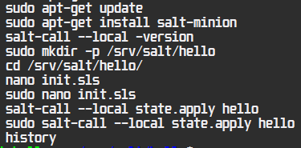
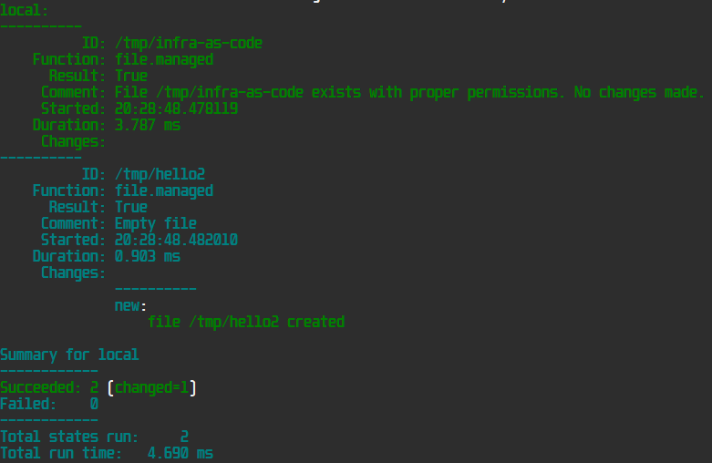
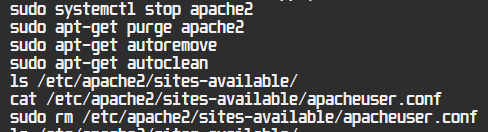
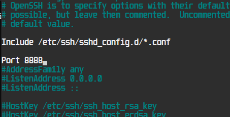
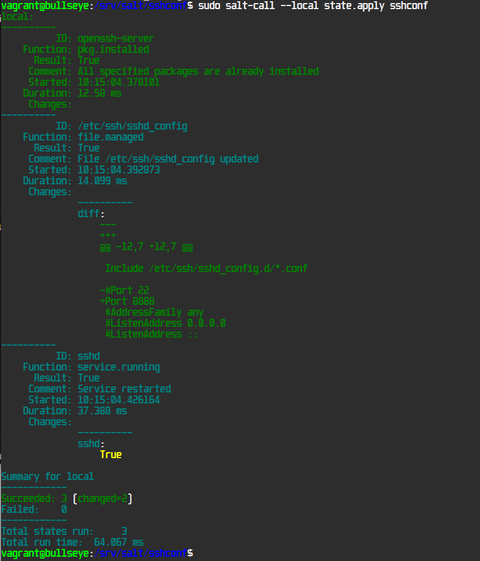
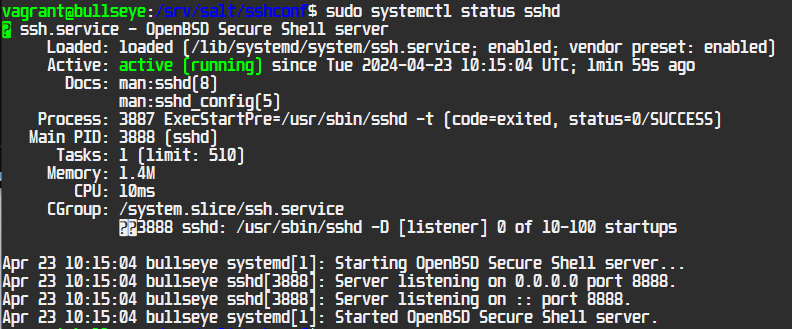
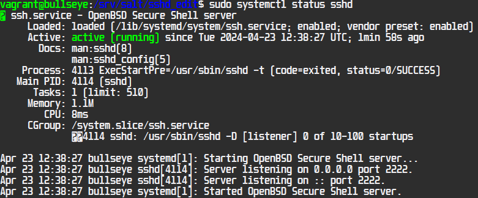
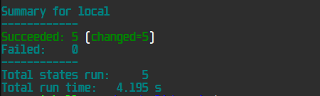
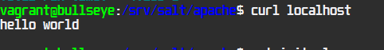

#  👻 h4 Daemons

- [👻 h4 Daemons](#-h4-daemons )
  - [📚 Summary & Assignments](#-summary--assignments )
    - [🌟 Examples & Getting started with infra as code](#-examples--getting-started-with-infra-as-code )
    - [🔤  YAML formatting](#--yaml-formatting )
    - [📦  Pkg-File-Service](#--pkg-file-service )
    - [📄  Assignments](#--assignments )
  - [🖐️  Hello SLS (A)](#️--hello-sls-a )
  - [🔝  Top.sls, running modules with a module (B)](#--topsls-running-modules-with-a-module-b )
  - [👤  User account setup](#--user-account-setup )
  - [🌐 Apache install (C)](#-apache-install-c )
    - [🛠️  Manually](#️--manually )
    - [🤖 Automate apache with saltstack modules](#-automate-apache-with-saltstack-modules )
  - [🔐  SSH configuration with salt (D)](#--ssh-configuration-with-salt-d )
    - [📄  Insert file (D.1)](#--insert-file-d1 )
    - [✏️ Edit file (D.2)](#️-edit-file-d2 )
  - [🔄  Automate apache for user & website (E)](#--automate-apache-for-user--website-e )
    - [Package > File > Service, module](#package--file--service-module )
  - [🏗️  Install Caddy (F)](#️--install-caddy-f )
  - [🚀 Install Nginx (G)](#-install-nginx-g )
  - [🔧 Tools used](#-tools-used )
  - [📋  References](#--references )

##  📚 Summary & Assignments

This assignment is about Infra as Code and Daemons, automating the installation and configuration with SaltStack. Tasks are done in a fresh VM with Debian 11.

###  🌟 Examples & Getting started with infra as code

```
$ sudo mkdir -p /srv/salt/hello
$ sudoedit /srv/salt/hello/init.sls
```
Our default SaltStack module directory is /srv/salt
Here the folder is created and we create a hello module with folder /hello/ containing init.sls


```
$ cat /srv/salt/hello/init.sls
/tmp/infra-as-code:
  file.managed

$ sudo salt '*' state.apply hello
```

The hello/init.sls creates a file in /tmp/ named infra-as-code

```
$ sudo salt '*' state.apply hello^C
$ sudoedit /srv/salt/top.sls
$ cat /srv/salt/top.sls
base:
  '*':
    - hello
```
By doing a top.sls configuration, we can determine what modules are run on ```state.apply``` without mentioning minions or modules in the command. 

```
$ sudo salt '*' state.apply
```
This command now runs hello module on all minions, like we configured in top.sls.

### 🔤  YAML formatting

- SaltStack modules (sls) uses YAML formatting

- YAML is built in blocks, Indentation is very important (two spaces(**NO TAB**))

### 📦  Pkg-File-Service

Package, File, Service. this is the common pattern to install a daemon.
- First we install the package, usually with apt-get install
- Then we modify the configuration files.
- And then we run/restart the service(Daemon)

### 📄  Assignments

<Details closed>
a) Hello SLS! Make Hello world mode by writing it to a text file, e.g. /srv/salt/hello/init.sls.

b) Top. Make top.sls so that several states of your choice are run automatically, e.g. with the command "sudo salt '*' state.apply" or "sudo salt-call --local state.apply".

c) Apache easy mode. Install Apache, replace its test page and make sure the daemon starts.
First by hand, then automatically.
Write the status to the sls file.
pkg-file-service
There is no need for watch in service because index.html is not a configuration file

d) SSHout. Add a new port where SSHd will listen.
If you use Vagrant, remember to leave port 22/tcp open - it's your own connection to the machine. You can simply add two "Port" lines to SSHd's configuration file, both ports will be opened.
You can find the correct setting by looking at the SSH configuration file
Now service-watch is needed to restart the daemon if the config file changes on the master

e) Optional: Apache. Install Apache to serve the web page. The website must appear on the server's home page (localhost). The HTML must be in a user's home directory, and editable with normal user rights, without sudo.

f) Optional: Caddy. Install Caddy to serve the web page. The website must appear on the server's home page (localhost). The HTML must be in a user's home directory, and editable with normal user rights, without sudo.

g) Optional: Nginx. Install Nginx (pronounced engine-X) to serve the web page. The web page must appear on the server's home page (localhost). The HTML must be in a user's home directory, and editable with normal user rights, without sudo.

</details>

## 🖐️  Hello SLS (A)

First we run update and salt install.
To test environment we run the examples from above, creating directory and running hello module locally.



```
sudo salt-call --local state.apply hello
```

Success.

## 🔝  Top.sls, running modules with a module (B)
we create a top.sls, save it in /srv/salt/ as top.sls

```
base:
  '*':
    - hello
    - hello2
```
then we run

```
sudo salt-call --local state.apply
```

Success, it ran both modules, and since it was first time running hello2 it created also hello2 file to temp.



## 👤  User account setup

To simulate online webserver installation, i first created a setup to automate user creation to preparate for assignment (E) and simple hardening. 

Setup module launches two modules first is **newuser** which creates a user with homefolder, predetermined password, also required to renew password on first login.

**hard** module installs fail2ban and disables root login.

<details closed>
<summary> Show code </summary>

*/srv/salt/setup.sls*
```
include:
  - newuser
  - hard
```

*/srv/salt/newuser/init.sls*
```
create_new_user:
  user.present:
    - name: apacheuser
    - password: '$6$xyz$Og.DFtRD6Y8kbcivJCPovp/s1nvOTtX9c7hXjnZIZKM22uec/fjMKzFditg8d.2mbig4h2j3EV0UznPCiL6Sn.'
    - shell: /bin/bash
    - home: /home/apacheuser
    - createhome: True
    - groups:
      - sudo

force_password_change:
  cmd.run:
    - name: chage -d 0 apacheuser
    - require:
      - user: create_new_user
```

*/srv/salt/hard/init.sls*
```
include:
  - .disable_root_login
  - .install_fail2ban
```
*/srv/salt/hard/disable_root_login.sls*
```  
disable_root_ssh:
  file.replace:
    - name: /etc/ssh/sshd_config
    - pattern: '^#?PermitRootLogin yes'
    - repl: 'PermitRootLogin no'
    - append_if_not_found: True

restart_ssh_service:
  service.running:
    - name: sshd
    - watch:
      - file: /etc/ssh/sshd_config
```
*/srv/salt/hard/install_fail2ban.sls*
```
install_fail2ban:
  pkg.installed:
    - name: fail2ban

configure_fail2ban:
  file.managed:
    - name: /etc/fail2ban/jail.local
    - source: salt://fail2ban/jail.local
    - template: jinja

fail2ban_service:
  service.running:
    - name: fail2ban
    - enable: True
    - require:
      - pkg: install_fail2ban
      - file: configure_fail2ban
```
*/srv/salt/fail2ban/jail.local*
```
[DEFAULT]
# Ban hosts for one hour:
bantime = 3600

# An IP address will be banned if it has generated "maxretry" during the last "findtime" seconds.
findtime = 600
maxretry = 3

[sshd]
enabled = true
port    = ssh
filter  = sshd
logpath = /var/log/auth.log
maxretry = 3
```
</details>

## 🌐 Apache install (C)

### 🛠️  Manually

Now we have our user account setup, we install apache2. We do all setups required for assignment C&E

```
sudo apt-get install apache2
```

then lets add our conf file
```
sudo nano /etc/apache2/sites-available/apacheuser.conf
```

now we  can disable the default site and enable our  new site:

```
sudo a2dissite 000-default.conf
sudo a2ensite apacheuser.conf
```

after configurations are all set, we need to restart the daemon
```
sudo systemctl restart apache2.service
```

adding hello world test index.html
```
sudo nano /home/apacheuser/www/index.html
```

lets test our site with curl

```
curl localhost
```


it works! we can now uninstall apache2 and config to move to automation




### 🤖 Automate apache with saltstack modules

To install apache2 and launch the service we can use a very simple module, we create apache_easy folder and insert init.sls with following code:

```
apache2:
  pkg.installed

apache2.service:
  service.running
```

then we run it with
```
sudo salt-call --local state.apply apache_easy
``` 

success, we can confirm with ```curl localhost```, and it prints us the default apache index.html

## 🔐  SSH configuration with salt (D)

For this assignment I wanted to create the same outcome in two different ways,  1. Inserting the conf file 2. Editing the conf file. The latter is more useful for  systems already running with custom configuration.

### 📄  Insert file (D.1)
Lets grab our grab our  config file and make adjustments, ```sudo cp /etc/ssh/sshd_config /srv/salt/sshconf/sshd_config``` then lets edit the file for our liking; 



And lets create init.sls file inside our apacheconf folder

```
openssh-server:
 pkg.installed
/etc/ssh/sshd_config:
 file.managed:
   - source: salt://sshconf/sshd_config
sshd:
 service.running:
   - watch:
     - file: /etc/ssh/sshd_config
```

then lets test our module

```
sudo salt-call --local state.apply sshconf
```




succeeded, now lets check the daemon status for confirmation:



correctly listening on port 8888.

### ✏️ Edit file (D.2)

Now we create a module to edit the file instead of inserting a file.

we create a new folder, sshd_edit. insert init.sls with following code:

*edit_sshd_conf_port searches for Port linein /etc/ssh/sshd_config and edits it to  "Port 2222", if line is not found it is added.*

```
edit_sshd_conf_port:
  file.replace:
    - name: /etc/ssh/sshd_config
    - pattern: '^#?Port \d+'
    - repl: 'Port 2222'
    - append_if_not_found: True

restart_ssh_service:
  service.running:
    - name: sshd
    - watch:
      - file: /etc/ssh/sshd_config
```

then we run the module with ```sudo salt-call --local state.apply sshd_edit```

Module works, we check the file with ```cat /etc/ssh/sshd_config```, port is now changed to "2222". We then confirm that service has restarted with correct port:


```
 sudo systemctl status sshd
```




## 🔄  Automate apache for user & website (E)

To automate the setup lets first create a folder ```sudo mkdir apache``` inside /srv/salt

Then we first add our apacheuser.conf with ```sudo nano apacheuser.conf```

```
<VirtualHost *:80>
    ServerAdmin webmaster@localhost
    ServerName apacheuser.local
    ServerAlias apacheuser.local
    DocumentRoot /home/apacheuser/www

    <Directory /home/apacheuser/www>
        Options Indexes FollowSymLinks
        AllowOverride All
        Require all granted
    </Directory>
</VirtualHost>
```
### Package > File > Service, module

Then we create our init.sls inside apache folder. This module first installs apache2, then moves our conf file to the correct folder, and removes the default conf and restarts the daemon.

```
apache2:
  pkg.installed

/etc/apache2/sites-available/apacheuser.conf:
  file.managed:
    - source: "salt://apache/apacheuser.conf"
    - watch_in:
      - service: "apache2.service"

/etc/apache2/sites-enabled/000-default.conf:
  file.absent:
    - watch_in:
      - service: "apache2.service"

/etc/apache2/sites-enabled/apacheuser.conf:
  file.symlink:
    - target: "../sites-available/apacheuser.conf"
    - watch_in:
      - service: "apache2.service"

apache2.service:
  service.running
```

after this we are ready to test the module

```
sudo salt-call --local state.apply apache
```




lets confirm




all good.


## 🏗️  Install Caddy (F)

WIP

## 🚀 Install Nginx (G)

WIP

##  🔧 Tools used

Visual Studio Code

Salt

Vagrant

VirtualBox

PowerShell

Google translate

##  📋  References


https://terokarvinen.com/2023/salt-vagrant/#infra-as-code---your-wishes-as-a-text-file
(Karvinen 2023)

https://docs.saltproject.io/salt/user-guide/en/latest/topics/overview.html#rules-of-yaml
Salt overview, SaltProject docs

https://terokarvinen.com/2018/04/03/pkg-file-service-control-daemons-with-salt-change-ssh-server-port/?fromSearch=karvinen%20salt%20ssh
pkg-file-service examples (Karvinen 2018)

Tips to automate hardening
ChatGPT 19.4.2024