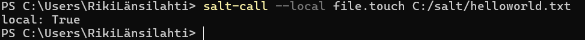
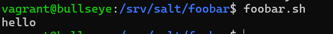

## H5 - Techniques for configuration

## Table of Contents

- [H5 - Techniques for configuration](#h5---techniques-for-configuration)
- [Table of Contents](#table-of-contents)
- [📓 Assignments](#-assignments)
- [Summary (X)](#summary-x)
  - [Summary of previous report with windows](#summary-of-previous-report-with-windows)
- [🪟 🧂 Salty Windows (A)](#--salty-windows-a)
- [🗄️ Gather data (B)](#️-gather-data-b)
- [🗃️ File command on windows (C)](#️-file-command-on-windows-c)
- [🔍 CSI Kerava (D)](#-csi-kerava-d)
- [New command with salt module (E)](#new-command-with-salt-module-e)
- [Gui 2 FS (F)](#gui-2-fs-f)
- [Bucket of commands  (G)](#bucket-of-commands--g)
- [🔧 Tools used](#-tools-used)
- [References](#references)


## 📓 Assignments

x) Read and summarize. (There is no need to take tests on the computer in this subsection x, just reading or listening and summarizing is enough. A few lines of French are enough for summarizing.)
A free-choice previous year's homework report on using Salt on Windows. You can find reports with, for example, Google or Duck search: salt windows karvinen.

a) Install Salt on Windows or Mac. Indicate that the installation is successful by running the 'salt-call --local' command. (If you have already installed before, simply testing the installation is enough here, and there is no need to do the installation again.)

b) Collect information from a Windows or Mac machine with the grains.items function. After 'grains.item', extract a few key pieces of information and analyze them, i.e. thoroughly explain what they are. Describe and compare the numbers.

c) Try Salt's file function on Windows or Mac.

d) CSI Kerava. Use 'find' to display the most recently modified files in the /etc/ directory and your home directory. Explain all the parameters and format string you use with 'man find'.

e) Command. Make a Salt mode that installs a new command on the system.

f) Optional: Gui2fs. Edit settings from a graphical user interface (GUI) program using the program's menus and dialogs. Look for this setting in the file system.

g) Optional: Bucket. Make a Salt mode that installs a folder of commands on the system. Make the mode using the recurse (tms) parameter so that you don't have to list each install command and script separately in the sls file.

## Summary (X)

This assignment is about different techniques and operating systems with salt.

### Summary of previous report with windows

*source* https://github.com/Eetu95/Palvelinten-hallinta/blob/master/h5.md

This assignment has the user install and configure a architecture where Windows PC is the slave, and Linux is the master.

Platfroms / tools used:

- Windows 10 Pro
- Xubuntu 18.04
- Salt
- VirtualBox

Only small hitches in setup, user forgot to launch powershell as admin.

First the user sets up the environment for master-slave connection, installing salt and configuring master ip

Then accepts the salt key on the master.

After establishing the connection the user tests connection with test.ping

```
sudo salt winion1 test.ping
```
It works and the user proceeds to install apps with pkg.install

User installs vlc, it was already installed. then he installs steam:
```
$ sudo salt winion1 pkg.install steam
```

Part C of the assignment failed becouse a suspected issue with the master-slave connection.


## 🧂 Salty Windows (A)

Ill start with a fresh Thinkpad L14 Windows 11 laptop.

First downloading the the setup installer from SaltProjects website https://docs.saltproject.io/salt/install-guide/en/latest/topics/install-by-operating-system/windows.html

Installation is pretty straight forward pressing next as we install to default folder ```C:\Program Files\Salt Project\Salt```

The Setup website also tells us the root folder location should be ```C:\ProgramData\Salt Project\Salt```

First we try if salt works in powershell as admin by running a local salt-call command:


## 🗄️ Gather data (B)

To gather some data from our windows system we use the grains.item command, followed by the fields we want to pull the data.

First we pull up grains.items to manually select what specific data we want to pull.

For now, we want to see the windows version, hostname, mac address, and the service tag:

```
salt-call --local grains.item host cpu_model osversion osfullname serialnumber hwaddr_interfaces
```


## 🗃️ File command on windows (C)

Lets create a helloworld file using file.touch on windows.

```
salt-call --local file.touch C:/salt/helloworld.txt
```




## 🔍 CSI Kerava (D)

Lets do a file search for latest edited files in /etc/

```
find /etc/ /home/ -printf "%T+%p\n" | sort -r | head -n 10
```

**find** command is the general search command, after that we give a path where to search, **printf** allows us to use custom format for printing the results, **%T** for time and **%p** for filename. **sort -r** prints in reversed order, **head -n 10** gives us the first 10 changed files, and the command then prints 10 latest changed files.


*note, without sudo prefix, we are denied the search from /etc/ssl/private*

## New command with salt module (E)

First we try out the example

```#!/usr/bin/bash" "echo moi"; 'chmod ugo+x foo.sh```

it creates a foo.sh command that echoes moi,
now we create a script that does the similiar thing, lets create the sh file with **file managed**. then pass the permissions with **mode**

```
create_foobar_script:
  file.managed:
    - name: /usr/local/bin/foobar.sh
    - mode: 0755
    - contents: |
        #!/bin/bash

        echo 'hello'
```

foobar.sh now works



## Gui 2 FS (F)

WIP

## Bucket of commands  (G)

WIP

## 🔧 Tools used

Salt

Vagrant

VirtualBox

VSCodium
 - Edwin's Pack extension

Github

Google translate

## References

https://terokarvinen.com/2024/configuration-management-2024-spring/#h5-tekniikoita
(karvinen 2024)

https://github.com/Eetu95/Palvelinten-hallinta/blob/master/h5.md

https://docs.saltproject.io/salt/install-guide/en/latest/topics/install-by-operating-system/windows.html

https://developer.hashicorp.com/vagrant/docs/installation