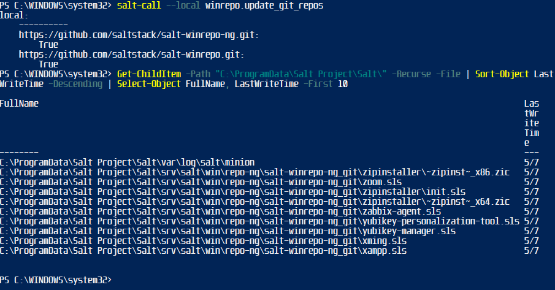
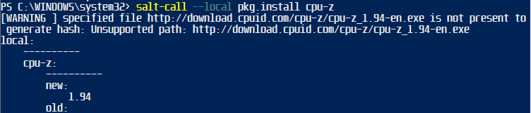

# H6 Benchmarking

## Table Of Contents


## Assignments
<Details closed>
x) Read and summarize. (There is no need to take tests on the computer in this subsection x, just reading or listening and summarizing is enough. A few lines are enough for summarizing.)

[Windows Package Manager](https://docs.saltproject.io/en/latest/topics/windows/windows-package-manager.html): Introduction, Install libraries, Populate the local Git repository, Update minion database, Install software package, Usage section. That is, from the beginning of the page to the end of the paragraph "Remove a package", excluding "Configuration". (It is recommended to apply the idempotent version of the installation, from external memory: 'sudo salt-call --local -l info state.apply pkg.installed curl').

a) A package of Windows. Install programs on Windows or Mac using Salt's pkg.installed function. (If you already did the necessary installations in class, you can write the environment installation from external memory, and now just install some new package. Notes written from memory are much more vague than those written during work, so mark clearly which parts were written from external memory and which parts were written while working.)

b) Benchmark. Look for 3-7 centralized management projects, for example the final project of this course "Oma moduli". The work must be modern centralized management (idempotent, infra as code, one truth). For example, a shell script alone will not do. The work may use any tool, e.g. Salt, Puppet, Ansible, Chef, Conftero, CFEngine. In this subsection, no tests are performed, but works are evaluated only based on their home pages. You can use search engines to search. List each
Purpose (i.e. "what's the use of this" i.e. "business purpose" i.e. "why would I want to install this".)
Yes, I did: (business purpose): "The robot will carry the ice cream from my fridge"
Not like this, listing technologies is not the purpose of the app: "ESP32 and Arduino control servos that use LIDAR to dodge tracks using a C++ program; the grip component uses a PDI controller..."
License
License name
Where in that work does that license read
What the license means, i.e. the main legal effect
Author and year
Dependencies: Platform (operating system, certain cloud...), network environment, etc.
Interesting, e.g
A useful end result
Interesting technology, e.g. some way to use Salt
Open questions and other considerations

c) Testbench. Drive the modules made by someone else.
Choose one of the modules you studied in the previous section. Justify your choice.
Check the code.
Is the code loading binaries? Downloading from outside the package manager? Are there any reliable software sources?
Run the code. If necessary, use a virtual environment or other isolation.
Test the end result.
Take screenshots at a suitable scale.
Comment and rate the module.
It is not necessary to fix all the bugs in the module, the purpose is to run the module and evaluate it.
If a module seems completely out of order, register your company and try another module.

d) Five ideas. List five ideas for your own module, the final assignment of the course. The module must have a purpose. It still doesn't have to solve any real business problem, but the purpose can be invented. One sentence is enough to describe each idea. Next time we will look together at the choice of topic and suitable tips. I need your own ideas as a basis so that I can give useful advice that is just right for you.
</details>

## About Win Package Manager (X)

Windows package manager is a tool for installing updating and removing software on windows os.

[Salt WinRepo List](https://github.com/saltstack/salt-winrepo)

### Common commands 

*pkg.list_pkgs* command prints currently installed packages on system

```
salt-call --local pkg.list_pkgs
```
*example:*


*pkg.list_available* Shows what versions are available

*pkg.install* installs packages

*pkg.remove* uninstalls packages

Updating database with

*pkg.refresh_db*

```salt-call --local pkg.refresh_db```

### Creating package definitions

Package files can be created to automate installing of software, "installation instructions" for the package setup.

*simple package example:*
```
firefox_x64:
  '74.0':
    full_name: Mozilla Firefox 74.0 (x64 en-US)
    installer: 'https://download-installer.cdn.mozilla.net/pub/firefox/releases/74.0/win64/en-US/Firefox%20Setup%2074.0.exe'
    install_flags: '/S'
    uninstaller: '%ProgramFiles(x86)%/Mozilla Firefox/uninstall/helper.exe'
    uninstall_flags: '/S'
  '73.0.1':
    full_name: Mozilla Firefox 73.0.1 (x64 en-US)
    installer: 'https://download-installer.cdn.mozilla.net/pub/firefox/releases/73.0.1/win64/en-US/Firefox%20Setup%2073.0.1.exe'
    install_flags: '/S'
    uninstaller: '%ProgramFiles(x86)%/Mozilla Firefox/uninstall/helper.exe'
    uninstall_flags: '/S'
```

*advanced jinja template for same install:*

```


firefox_x64:
  
  '{{ version }}':
    full_name: 'Mozilla Firefox {{ version }} (x64 {{ lang }})'
    installer: 'https://download-installer.cdn.mozilla.net/pub/firefox/releases/{{ version }}/win64/{{ lang }}/Firefox%20Setup%20{{ version }}.exe'
    install_flags: '/S'
    uninstaller: '%ProgramFiles%\Mozilla Firefox\uninstall\helper.exe'
    uninstall_flags: '/S'
  
```

*example for MSI installs:*

```
MyApp:
  '1.0':
    full_name: MyApp
    installer: 'salt://win/repo-ng/MyApp/MyApp.1.0.msi'
    install_flags: '/qn /norestart'
    uninstaller: '{B5B5868F-23BA-297A-917D-0DF345TF5764}'
    uninstall_flags: '/qn /norestart'
    msiexec: True
  '1.1':
    full_name: MyApp
    installer: 'salt://win/repo-ng/MyApp/MyApp.1.0.msi'
    install_flags: '/qn /norestart /update "%cd%\\MyApp.1.1.msp" '
    uninstaller: '{B5B5868F-23BA-297A-917D-0DF345TF5764}'
    uninstall_flags: '/qn /norestart'
    msiexec: True
    cache_file: salt://win/repo-ng/MyApp/MyApp.1.1.msp

```

more examples can be browsed from the [winrepo github](https://github.com/saltstack/salt-winrepo) or [winrepo next gen](https://github.com/saltstack/salt-winrepo-ng)


## Package for windows (A)
 
Lets try and install a package on our system, first i update the local repo

```
salt-call --local winrepo.update_git_repos
```

Then i wanted to know where the repo was saved locally, for this I used

```
Get-ChildItem -Path "C:\ProgramData\Salt Project\Salt\" -Recurse -File | Sort-Object LastWriteTime -Descending | Select-Object FullName, LastWriteTime -First 10
```



files were cloned to to

*C:\ProgramData\Salt Project\Salt\srv\salt\win\repo-ng\salt-winrepo-ng_git*

and 

*C:\ProgramData\Salt Project\Salt\srv\salt\win\repo\salt-winrepo_git*

Now lets install a package, i chose cpu-z

```
salt-call --local pkg.install cpu-z
```



cpu-z was successfully installed, altough 1.94 is not the newest version...

# Benchmarking Centralized Management Projects

## Introduction

For the benchmarking study i searched for projects made with salt in the same course but from previous years with following google searches:

```
site:github.com "h7" + "salt" OR "oma moduli" + "salt"
```
and
```
"h7" + "salt" + "windows" OR "oma moduli" + "salt" + "windows"
```

## Project Selection Criteria

I wanted to choose salt + windows based projects to educate myself preparing for my own project thats planned to be on windows minions. This was the harder part since most previous projects used linux only.

## Selected Projects Overview

Visual Boy Advanced Miko Hirvelä 2021
https://github.com/mikohir/Palvelinten-hallinta/blob/main/H7.md

Front end + Graphical designer apps, sampo hautala 2018
https://sampohautala.wordpress.com/2018/12/09/ph-h7-oma-moduli/

7 Different OS minions, Irene Kunnari
https://irenekunnari.wordpress.com/salt-mini-project/

### Project 1: Visual Boy Advanced

https://github.com/mikohir/Palvelinten-hallinta/blob/main/H7.md

#### Business Purpose
- **Description**: To install gaming software and games automatically.

#### License
- **License Name**: GPL-3.0 license
- **Location of License Information**: [GPL3 file in repository](https://github.com/mikohir/Palvelinten-hallinta/tree/main?tab=GPL-3.0-1-ov-file#readme)
- **Legal Impact**: Its free to use, modify and share. Also requires deriative works to maintain the same GPL3 license.

#### Author and Year
- **Author**: Miko Hirvelä
- **Year**: 2021

#### Dependencies
- **Platforms**: Xubuntu, Salt
- **Network Environment**: Virtual environment with master and slave VM:s

#### Interesting Aspects
- **Useful Outcomes**: Similiar installing setup could be used to automate installation to commercial retro console devices.
- **Technologies used**: Virtual machines, Salt, gaming console emulator.
- **Other Notes**: Well made document also containing errors and solving / overcoming them. Would have wanted to see a separate repository containing the files.

### Project 2: Front end dev linux + Graphical apps windows

https://sampohautala.wordpress.com/2018/12/09/ph-h7-oma-moduli/

#### Business Purpose
- **Description**: Automating installation for development and graphical designer workstations.

#### License
- **License Name**: GPL-3.0 license
- **Location of License Information**: [GPL3 file in repository](https://github.com/sampohautala/salt/blob/master/LICENSE)
- **Legal Impact**: Its free to use, modify and share. Also requires deriative works to maintain the same GPL3 license.

#### Author and Year
- **Author**: Sampo Hautala
- **Year**: 2018

#### Dependencies
- **Platforms**: Linux, Windows
- **Network Environment**: xubuntu master, win10 + ubuntu 18.04 slaves

#### Interesting Aspects
- **Useful Outcomes**: Automating small team development workspace, a linux developer workstation and windows graphical design workstation.
- **Technologies used**: Virtual machines, Salt, Git
- **Other Notes**: Well made report, Linux machine is installed with Apache2, PHP+configuration,  Gedit, Git, Firewall. Windows machine is installed with Blender, GIMP, Inkscape, CPU-z Gpu-Z, 7zip and Git.

### Project 3: 7 Different OS minions

https://irenekunnari.wordpress.com/salt-mini-project/

#### Business Purpose
- **Description**: Controlling different operating systems with one master.

#### License
- **License Name**: Not Found / None
- **Location of License Information**: Not Found
- **Legal Impact**: If there is no license, there is **NO** right to use it

#### Author and Year
- **Author**: Irene Kunnari
- **Year**: 2018

#### Dependencies
- **Platforms / Operating systems**: Ubuntu 18.04.2 LTS, CentOS, Fedora (32-bit), ElementaryOS, MacOS, Windows 10 Home, Windows 7 Ultimate (32-bit)

- **Network Environment**: master: DigitalOcean Ubuntu 18.04.2 LTS virtual machine
Minions on virtualbox: Fedora, ElementaryOS, Windows 10, Windows 7
Minion MacOS barebone Macbook Air
CentOS hosted on Azure

#### Interesting Aspects
- **Useful Outcomes**: Controlling many different operating systems
- **Technologies used**: Virtual machines, Salt
- **Other Notes**: Top file to automate some modules and installations for all systems. Report contains a video showcasing the top.sls


## Testbench (C)

I wanted to choose a windows module, there was not many options so i went with Irene Kunnari:s windowsdesk.sls

```
windowsdesk:
  pkg.installed:
    - pkgs:
      - firefox
      - putty
```


Result was partly expected, i already had putty installed. But firefox install failed due to error: Unable to locate package firefox

## Ideas for modules (D)

These modules are planned for windows clients in a classroom setting:

Clean desktop

Initiate Windows Update

Install Putty with WPM

Install NIC Driver with WPM

Gather Service tags and other client information/specs

Wakeonlan with gathered MAC:s


## Resources

https://irenekunnari.wordpress.com/salt-mini-project/

https://sampohautala.wordpress.com/2018/12/09/ph-h7-oma-moduli/

https://github.com/mikohir/Palvelinten-hallinta/blob/main/H7.md

https://terokarvinen.com/2024/configuration-management-2024-spring/

https://github.com/saltstack/salt-winrepo