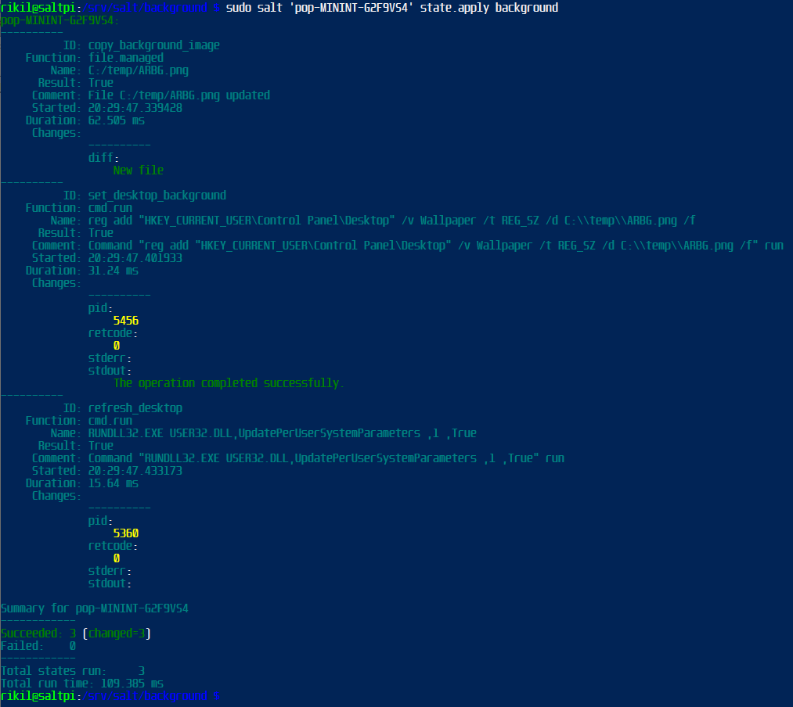
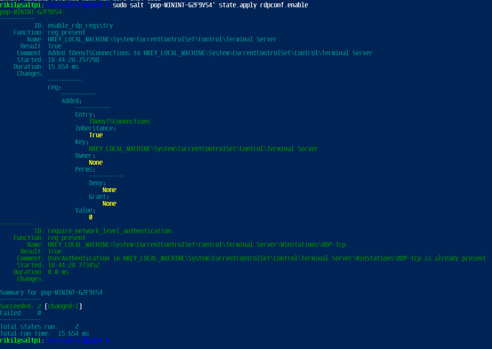

H7 - my module - Education center management

# 🧂  SaltStack Classroom Management


## Table Of Contents


- [🧂  SaltStack Classroom Management](#--saltstack-classroom-management )
  - [Table Of Contents](#table-of-contents )
    - [🌟 Introduction](#-introduction )
    - [✍️ Author](#️-author )
    - [📜  License](#--license )
    - [🏢  Business purpose](#--business-purpose )
  - [🌍  Environment](#--environment )
    - [🎓 Master](#-master )
    - [🤖  Minions](#--minions )
    - [🚇 Remote Tunnel feat. salt-cloud](#-remote-tunnel-feat-salt-cloud )
      - [🚀 How to launch vm:s on hetzner with salt-cloud](#-how-to-launch-vms-on-hetzner-with-salt-cloud )
      - [🛠️ Provider configuration](#️-provider-configuration )
      - [📐 Profile configuration](#-profile-configuration )
      - [🌐 Creating the VM](#-creating-the-vm )
  - [🐱‍💻 Install Minions (BadUSB)](#-install-minions-badusb )
  - [🗑️ Salt State to Delete setup files](#️-salt-state-to-delete-setup-files )
    - [📄 State file](#-state-file )
    - [⌨️ Command to run](#️-command-to-run )
  - [🖼️ Desktop background module](#️-desktop-background-module )
    - [📄 State file](#-state-file-1 )
    - [⌨️ Command to run](#️-command-to-run-1 )
    - [Screenshot](#screenshot )
  - [🖥️ RDP Enable & Disable](#️-rdp-enable--disable )
    - [📄 State file](#-state-file-2 )
    - [⌨️ Command(s) to run](#️-commands-to-run )
  - [📅 Custom windows update schedule](#-custom-windows-update-schedule )
    - [📄 State file](#-state-file-3 )
    - [⌨️ Command to run](#️-command-to-run-2 )
    - [🚫 Disable Sleep](#-disable-sleep )
    - [📄 State file](#-state-file-4 )
    - [⌨️ Command to run](#️-command-to-run-3 )
  - [📝 TODO](#-todo )
  - [🛠️ Tools / programs / os / hardware used](#️-tools--programs--os--hardware-used )
  - [📚 Resources](#-resources )

### 🌟 Introduction
This is a collection of salt modules for windows minions in an education center for central management.

### ✍️ Author
Riki Länsilahti

### 📜  License
Open Source, GPL3

### 🏢  Business purpose
To automate, manage and provide remote support for classroom windows computers


## 🌍  Environment
### 🎓 Master
- Raspberry Pi 5 8gb
- Pi OS Lite (Debian 12)
- 256GB SD card
- pivpn(wg)

### 🤖  Minions
- Physical Desktops
- Students Win 10 Lenovo (12 Minions)
- Instructor Win 10 Dell (1 Minion)

### 🚇 Remote Tunnel feat. salt-cloud
- Wireguard
- Hetzner Hel1
- Salt-cloud setup

<details closed>

#### 🚀 How to launch vm:s on hetzner with salt-cloud

Salt-Master and Salt-Cloud preinstalled

```
sudo salt-pip install hcloud
```
#### 🛠️ Provider configuration

hetzner provider conf is created inside /etc/salt/cloud.providers.d we name our hetzner.conf

```
hetzner-config:
  driver: hetzner
  key: "hetzner_api_key"
```


#### 📐 Profile configuration

next we create hetzner.conf inside /etc/salt/cloud.providers.d/

```
sudo nano /etc/salt/cloud.providers.d/hetzner.conf
```

then we configure the server we want to host, for this we choose wireguard as image, and CPX11 as the size, HEL1 for location finland. for this we create profile.conf inside /etc/salt/cloud.profiles.d named hetzner.conf

```
wireguard@hetzner:
  provider: hetzner
  image: wireguard
  size: cpx11
```

####  🌐 Creating the VM

To create the VM we use the command:
Salt-cloud -p <profile-name> <hostname>

```
 sudo salt-cloud -p wireguard@hetzner wgitop
```


</details>

##  🐱‍💻 Install Minions (BadUSB)

To install salt-minion on the classroom computers i created a keyboard emulator with arduino pro micro (atmega32u4). It does following tasks when plugged to pc:

- Launch powershell as admin
- Accept UAC
- Gather hostname
- Download salt-minion-setup to c:\temp
- Install salt minion setup with defined master ip, sets minion name as minion-$hostname
- prints master ip and minion name

*code:*
<details closed>

```
#include <Keyboard.h>
#include <Keyboard_sv_SE.h>


// master ip
String masterIP = "127.0.0.1";


void setup() {
  Keyboard.begin(KeyboardLayout_sv_SE);
  delay(8000);


  // start pshell as admin
  openPowerShellAsAdmin();
  prepareEnvironment();

  // generate minion name as "minion-*HOSTNAME*"
  Keyboard.print("$minionName = 'minion-' + (Get-ComputerInfo).CsDNSHostName");
  Keyboard.press(KEY_RETURN);
  Keyboard.releaseAll();
  delay(500);

  // start download
  initiateDownload();

  // start install
  installSaltMinion();

  // Close pshell
  setupFinished();
  Keyboard.end();
}

void openPowerShellAsAdmin() {
  Keyboard.press(KEY_LEFT_GUI);
  Keyboard.press('r');
  delay(10);
  Keyboard.releaseAll();
  delay(200);

  Keyboard.print("powershell");
  delay(10);
  Keyboard.press(KEY_LEFT_CTRL);
  Keyboard.press(KEY_LEFT_SHIFT);
  Keyboard.press(KEY_RETURN);
  delay(10);
  Keyboard.releaseAll();
  delay(1500);  // wait for uac

  // accept uac
  // leftkey
  Keyboard.press(KEY_LEFT_ARROW);
  delay(100);
  Keyboard.releaseAll();
  delay(100);
  // enter
  Keyboard.press(KEY_RETURN);
  delay(100);
  Keyboard.releaseAll();
  delay(3000);  // wait pshell opening
}

void prepareEnvironment() {
  Keyboard.print("if (-Not (Test-Path 'C:\\\\Temp')) { New-Item -Path 'C:\\\\Temp' -ItemType Directory }");
  Keyboard.press(KEY_RETURN);
  delay(10);
  Keyboard.releaseAll();
  delay(500);
}

void initiateDownload() {
  Keyboard.print("$url = 'https://repo.saltproject.io/salt/py3/windows/latest/Salt-Minion-3007.0-Py3-AMD64-Setup.exe'");
  Keyboard.press(KEY_RETURN);
  Keyboard.releaseAll();
  delay(200);

  Keyboard.print("$output = 'C:\\\\Temp\\\\SaltMinionSetup.exe'");
  Keyboard.press(KEY_RETURN);
  Keyboard.releaseAll();
  delay(200);

  Keyboard.print("Invoke-WebRequest -Uri $url -OutFile $output");
  Keyboard.press(KEY_RETURN);
  Keyboard.releaseAll();
  delay(5000);  // extra wait after dl
}

void installSaltMinion() {
  // setup command
  Keyboard.print("Start-Process -FilePath 'C:\\\\Temp\\\\SaltMinionSetup.exe' -ArgumentList \"/S /master=" + masterIP + " /minion-name=$minionName\" -Wait");
  Keyboard.press(KEY_RETURN);
  Keyboard.releaseAll();
  delay(5000);  // wait
}

// setup finish, print details
void setupFinished() {
  Keyboard.print("echo \"Install complete, master IP: " + masterIP + ", Minion name: $minionName\"");
  Keyboard.press(KEY_RETURN);
  delay(10);
  Keyboard.releaseAll();
  delay(500);
}

void loop() {}

```

</details>

## 🗑️ Salt State to Delete setup files
Cleanup salt-minion setup
- removes salt setupfile from c:\temp on minion

### 📄 State file
*removesetup/init.sls*
```
remove_salt_minion_setup:
  file.absent:
    - name: C:\Temp\SaltMinionSetup.exe
```
### ⌨️ Command to run
```
sudo salt 'minion' state.apply removesetup
```


## 🖼️ Desktop background module

Salt module to change background image on windows minions.
- Copies image file from master to minion(s)
- Sets background image in registry
- Refresh rundll to instantly renew wallpaper (experimental)

### 📄 State file

*background/init.sls*

```
copy_background_image:
  file.managed:
    - name: 'C:/temp/ARBG.png'
    - source: salt://background/ARBG.png
    - makedirs: True

set_desktop_background:
  cmd.run:
    - name: 'reg add "HKEY_CURRENT_USER\Control Panel\Desktop" /v Wallpaper /t REG_SZ /d C:\\temp\\ARBG.png /f'
    - require:
      - file: copy_background_image

refresh_desktop:
  cmd.run:
    - name: 'RUNDLL32.EXE USER32.DLL,UpdatePerUserSystemParameters ,1 ,True'
    - require:
      - cmd: set_desktop_background
```
### ⌨️ Command to run

```
sudo salt 'minion' state.apply background
```

### Screenshot




## 🖥️ RDP Enable & Disable

States to enable or disable RDP

### 📄 State file 
*rdpconf/enable.sls*
```
enable_rdp_registry:
  reg.present:
    - name: 'HKEY_LOCAL_MACHINE\System\CurrentControlSet\Control\Terminal Server'
    - vname: 'fDenyTSConnections'
    - vdata: 0
    - vtype: REG_DWORD

require_network_level_authentication:
  reg.present:
    - name: 'HKEY_LOCAL_MACHINE\System\CurrentControlSet\Control\Terminal Server\WinStations\RDP-Tcp'
    - vname: 'UserAuthentication'
    - vdata: 1
    - vtype: REG_DWORD
```

*rdpconf/disable.sls*
```
disable_rdp_registry:
  reg.present:
    - name: 'HKEY_LOCAL_MACHINE\System\CurrentControlSet\Control\Terminal Server'
    - vname: 'fDenyTSConnections'
    - vdata: 1
    - vtype: REG_DWORD
```

### ⌨️ Command(s) to run

*Enable rdp*
```
sudo salt 'minion-name' state.apply rdpconf.enable
``` 
*Disable rdp*
```
sudo salt 'minion-name' state.apply rdpconf.disable
```



## 📅 Custom windows update schedule

Setting update schedule into registry with salt state:
- AutoUpdate 0
- AUOptions 4 (download and install (Only valid if values exist for ScheduledInstallDay and ScheduledInstallTime.))
- ScheduledInstallDay. (1Sunday - 7Saturday) default 7
- ScheduledInstallTime. time of day 3 = 3am

### 📄 State file
*updatewin/init.sls*
```


win_updateschedule_disable_auto_update:
  reg.present:
    - name: 'HKEY_LOCAL_MACHINE\SOFTWARE\Policies\Microsoft\Windows\WindowsUpdate\AU'
    - vname: 'NoAutoUpdate'
    - vdata: 0
    - vtype: REG_DWORD

win_updateschedule_auto_options:
  reg.present:
    - name: 'HKEY_LOCAL_MACHINE\SOFTWARE\Policies\Microsoft\Windows\WindowsUpdate\AU'
    - vname: 'AUOptions'
    - vdata: 4
    - vtype: REG_DWORD

win_updateschedule_install_day:
  reg.present:
    - name: 'HKEY_LOCAL_MACHINE\SOFTWARE\Policies\Microsoft\Windows\WindowsUpdate\AU'
    - vname: 'ScheduledInstallDay'
    - vdata: {{ update_day }}
    - vtype: REG_DWORD

win_updateschedule_install_time:
  reg.present:
    - name: 'HKEY_LOCAL_MACHINE\SOFTWARE\Policies\Microsoft\Windows\WindowsUpdate\AU'
    - vname: 'ScheduledInstallTime'
    - vdata: 3
    - vtype: REG_DWORD
```
### ⌨️ Command to run
```
sudo salt 'minion-name' state.apply updateWin pillar='{"update_day": 1}'
```

### 🚫 Disable Sleep

Stop minions from sleeping

- disable hibernation 
- disable sleep
- powercfg commands

### 📄 State file

*disableSleep.sls*
```
disable_sleep_and_hibernation:
  cmd.run:
    - names:
      - powercfg /change standby-timeout-ac 0
      - powercfg /change standby-timeout-dc 0
      - powercfg /change hibernate-timeout-ac 0
      - powercfg /change hibernate-timeout-dc 0
    - shell: powershell
```
### ⌨️ Command to run

```
sudo salt 'minion' state.apply disableSleep
```

## 📝 TODO
custom grains (physical location grains - classroom, row etc.)
wol, wollist
install custom packages
uac control

## 🛠️ Tools / programs / os / hardware used

- SaltStack (salt-master, salt-minion, salt-cloud)
- Win10
- Win11
- debian 12
- arduino
- Raspberry pi
- wireguard

## 📚 Resources


https://terokarvinen.com/2024/configuration-management-2024-spring/
karvinen 2024

desktop bg change
https://c-nergy.be/blog/?p=15291

disable sleep
https://answers.microsoft.com/en-us/windows/forum/all/change-sleep-settings-in-windows-10-from-cmd/d7c7e1a9-76d1-4f79-b44a-d9c50d987dbc

enable rdp with commands
https://monovm.com/blog/how-to-enable-remote-desktop-in-windows-10/

windows update with registry
https://learn.microsoft.com/de-de/security-updates/windowsupdateservices/18127499

registry editing with salt
[chat gpt](images/gptregedit.png)